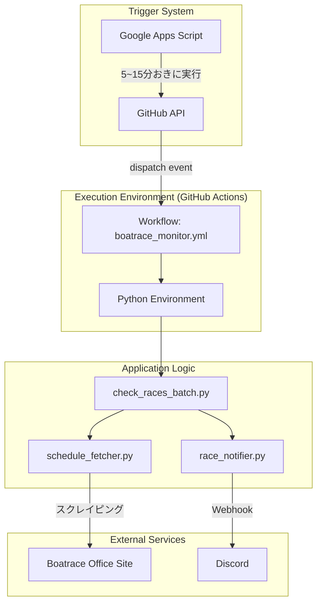
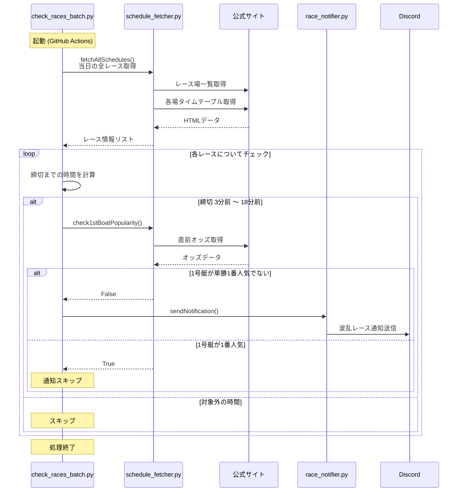

# プロジェクト構成とワークフロー

このドキュメントでは、競艇通知ツールのシステム全体像と内部ロジックを解説します。

## 1. システム全体像 (Architecture)

Google Apps Script (GAS) が「正確な時計」として機能し、そこからのリクエストをトリガーに GitHub Actions が動き出します。

## 2. Pythonスクリプト詳細フロー

メインスクリプト `check_races_batch.py` を中心とした処理の流れです。

## 3. ファイル役割一覧

| ファイル名 | 役割 | 主なクラス/関数 |
| :--- | :--- | :--- |
| `check_races_batch.py` | **実行のエントリーポイント**。 時間の判定と全体の指揮を行う。 | `check_and_notify()` |
| `schedule_fetcher.py` | **データ取得担当**。 公式サイトからスケジュールやオッズを取得・解析する。 | `ScheduleFetcher` `fetchAllSchedules()` `check1stBoatPopularity()` |
| `race_notifier.py` | **通知担当**。 Discordへのメッセージ送信を行う。 | `RaceNotifier` `sendNotification()` |
| `.github/workflows/boatrace_monitor.yml` | **インフラ設定**。 Python環境の構築とスクリプト実行を定義。 | - |

## 4. メンテナンスガイド

### 通知条件を変えたい場合
`scripts/check_races_batch.py` の以下の定数を変更してください。
- `MIN_OFFSET`: 何分前から検知するか（現在: 3）
- `MAX_OFFSET`: 何分先まで検知するか（現在: 18）

### オッズ条件を変えたい場合
`scripts/schedule_fetcher.py` の `check1stBoatPopularity` メソッドを改造するか、新しい判定メソッドを追加してください。
